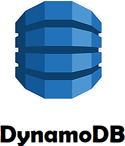

<!-- =========================================================
     ADVAIT DALVI — GITHUB PROFILE README
     ========================================================= -->

<!-- ============ CUSTOM CODER/AI BANNER ============ -->

  

<!-- ============ ANIMATED TAGLINE ============ -->

  

<!-- ============ PROFILE VIEWS + FOLLOWERS ============ -->

  
  

---

## 👋 About Me

I'm a business graduate (BBA, International Business & Marketing) currently pursuing my **MSc in Artificial Intelligence for Business at SP Jain, Dubai**. I sit at the intersection of business and applied AI — I've shipped two end-to-end AI products that solve real decision-making problems, and I like turning "black-box AI" into something a manager can verify and trust.

- 🎯 **Goal:** Grow into an **AI Business Analyst** who helps organisations use AI to make faster, smarter, more confident decisions
- 🔨 **Currently building:** `TalkToData` (NL → SQL) and `Optimus` (RL-based dynamic pricing co-pilot)
- 🧠 **Learning:** LLM guardrails, evaluation, and productionising AI features
- 📫 **Reach me:** [advaitdalvi03@gmail.com](mailto:advaitdalvi03@gmail.com)
- 💬 **Ask me about:** LLM prompt design, NL-to-SQL, reinforcement learning for pricing, or how to make AI outputs *verifiable*

---

## 🌐 Connect With Me

  
  
  
  

---

## 🎮 Pac-Man Contribution Graph

  

---

## 💻 Tech Stack

*Icon only — hover to identify, click to visit the official site.*

### 🧠 AI / ML / LLMs

  &nbsp;&nbsp;&nbsp;
  &nbsp;&nbsp;&nbsp;
  &nbsp;&nbsp;&nbsp;
  &nbsp;&nbsp;&nbsp;
  &nbsp;&nbsp;&nbsp;
  &nbsp;&nbsp;&nbsp;
  &nbsp;&nbsp;&nbsp;

### 📊 Data & Analytics

  &nbsp;&nbsp;&nbsp;
  &nbsp;&nbsp;&nbsp;
  &nbsp;&nbsp;&nbsp;
  &nbsp;&nbsp;&nbsp;
  

### 🗄️ Databases

  &nbsp;&nbsp;&nbsp;
  &nbsp;&nbsp;&nbsp;
  &nbsp;&nbsp;&nbsp;
  

### 🚀 Deployment & Tooling

  &nbsp;&nbsp;&nbsp;
  &nbsp;&nbsp;&nbsp;
  &nbsp;&nbsp;&nbsp;
  &nbsp;&nbsp;&nbsp;
  &nbsp;&nbsp;&nbsp;
  &nbsp;&nbsp;&nbsp;
  &nbsp;&nbsp;&nbsp;

### 💼 Business & Product Skills

  
  
  
  
  
  
  
  

---

## 🚀 Featured Projects

<table align="center" width="100%">
  <tr>
    <td width="50%" valign="top" align="left">
       
      <h3>&nbsp;🗣️ TalkToData</h3>
      
&nbsp;<em>Ask your database in plain English.</em>

      
&nbsp;An AI dashboard that lets a non-technical manager type a business question — <em>"what was yesterday's revenue?"</em> — and get the answer back in seconds, with the SQL shown underneath so they can verify it. Three engines side-by-side (rule-based, raw LLM, LLM + guardrails) so users feel the difference between brittle rules and safe AI.

      

        &nbsp;
        
        
        
      

      
&nbsp;<strong>Status:</strong> 🚧 In Progress

      
&nbsp;

    </td>
    <td width="50%" valign="top" align="left">
       
      <h3>&nbsp;💰 Optimus</h3>
      
&nbsp;<em>Dynamic-pricing co-pilot that decides — and explains.</em>

      
&nbsp;A pricing assistant built on a 200-product electronics catalogue. A Q-learning agent trained over 81 market situations (inventory × demand × season × competitor price) discovers pricing patterns on its own. A FLAN-T5 explanation layer then turns each decision into a two-sentence business rationale a manager can act on.

      

        &nbsp;
        
        
        
        
      

      
&nbsp;<strong>Status:</strong> 🚧 In Progress

      
&nbsp;

    </td>
  </tr>
</table>

---

## 📊 GitHub Stats

  
  

  

  
  

---

## ✍️ Dev Quote of the Day

  

---

## 🎓 Currently Learning

- 🤖 **Advanced LLM techniques** — RAG, function calling, agent orchestration
- 📈 **Applied RL for business** — beyond Q-learning into policy gradient methods
- 🛡️ **Trustworthy AI** — evaluation frameworks, guardrails, explainability
- ☁️ **MLOps** — MLflow, model versioning, deployment pipelines

---

## 🤝 Open to Collaborate On

- AI products where explainability is non-negotiable (fintech, healthcare, retail)
- NL-to-SQL and analytics copilots for non-technical users
- Business-facing AI dashboards built on Gradio / Streamlit + Hugging Face
- Content on making AI outputs *verifiable* for stakeholders

📩 **Reach out:** [advaitdalvi03@gmail.com](mailto:advaitdalvi03@gmail.com)

---

<!-- ============ FOOTER ============ -->

  

